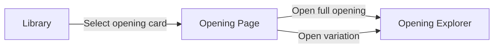

# ChessTree — UX/UI Requirements & Screen Structure

## Executive summary

This document defines UX, UI, and interaction requirements for the ChessTree MVP, ready for a Figma handoff and developer implementation. The MVP scope includes Home, Library, Opening Page, Opening Explorer, and Contact Us. It excludes authentication, saving progress, user-generated openings, and engine analysis features beyond displaying precomputed evaluation fields.

The interface uses a dark theme with dark gray surfaces and a green accent. Large surfaces use dark gray instead of pure black to support readability and elevation cues. citeturn3search0

Design and dev handoff should rely on entity["company","Figma","design collaboration platform"] components, variants, and Dev Mode inspection for values such as spacing, tokens, and component properties. citeturn3search17turn3search25turn3search13 The project workflow also aligns with your internal checklist for SCSS, semantic HTML, SEO, and toolchain readiness. fileciteturn0file1

User journey (core):



## Design tokens and UI foundations

### Color tokens

Base palette (fixed):

| Token | Hex | Usage |
|---|---:|---|
| color.bg | #121212 | App background |
| color.surface | #1E1E1E | Primary surfaces, sections, panels |
| color.card | #252525 | Cards, elevated containers |
| color.text.primary | #FFFFFF | Primary text |
| color.text.secondary | #A0A0A0 | Secondary text, hints |
| color.accent | #22C55E | Primary interactive accent, highlights |

Derived semantic tokens (minimal, required for states and errors):

| Token | Value | Usage |
|---|---|---|
| color.border.subtle | rgba(255,255,255,0.10) | Card borders, dividers |
| color.border.strong | rgba(255,255,255,0.18) | Focused field border, active separators |
| color.overlay.hover | rgba(255,255,255,0.06) | Hover on dark surfaces |
| color.overlay.active | rgba(255,255,255,0.10) | Pressed state |
| color.focus.ring | rgba(34,197,94,0.55) | Focus ring outline |
| color.state.error | #EF4444 | Error border, error icon (text remains primary/secondary) |
| color.state.warning | #F59E0B | Warning badges (inaccuracy) |
| color.state.info | #60A5FA | Informational chips (optional) |

Contrast requirements:

- Normal text uses ≥ 4.5:1 contrast against its background. citeturn0search12turn0search4  
- Large text uses ≥ 3:1 contrast. citeturn0search4  
- UI component boundaries and meaningful non-text graphics use ≥ 3:1 contrast. citeturn4search10turn4search2  

Material guidance supports dark gray surfaces for dark themes and emphasizes text legibility and contrast. citeturn3search0turn3search1

### Typography tokens

Font families:

| Token | Value | Usage |
|---|---|---|
| font.ui | Inter, system-ui, Segoe UI, Roboto, Arial, sans-serif | UI text |
| font.mono | JetBrains Mono, ui-monospace, SFMono-Regular, Menlo, monospace | SAN move text, code-like fields |

Type scale (desktop first):

| Style | Size | Line height | Weight | Usage |
|---|---:|---:|---:|---|
| H1 | 40 | 48 | 700 | Home hero headline |
| H2 | 28 | 36 | 700 | Page titles |
| H3 | 20 | 28 | 600 | Section titles |
| Body | 16 | 24 | 400 | Default text |
| Body strong | 16 | 24 | 600 | Key labels |
| Small | 14 | 20 | 400 | Meta, helper text |
| Micro | 12 | 16 | 400 | Chips, captions, table labels |
| SAN mono | 14 | 20 | 500 | Move list, node move code |

Typography rules:

- Avoid long paragraphs in UI. Prefer shorter blocks and clear hierarchy.
- Use secondary text for hints only, not for essential instructions.

### Spacing scale

Base unit: 4px.

| Token | px |
|---|---:|
| space.1 | 4 |
| space.2 | 8 |
| space.3 | 12 |
| space.4 | 16 |
| space.5 | 20 |
| space.6 | 24 |
| space.8 | 32 |
| space.10 | 40 |
| space.12 | 48 |

Layout grid for 1440px:

- 12-column grid
- Gutter: 24px
- Outer margins: 80px
- Content max-width guideline (non-Explorer pages): 1280px

### Radius, shadows, motion

Radius:

| Token | px | Usage |
|---|---:|---|
| radius.1 | 6 | Inputs, buttons |
| radius.2 | 10 | Cards, panels |
| radius.3 | 14 | Large containers, modals |

Shadows (dark UI):

| Token | CSS suggestion | Usage |
|---|---|---|
| shadow.1 | 0 2px 8px rgba(0,0,0,0.35) | Cards |
| shadow.2 | 0 6px 18px rgba(0,0,0,0.45) | Modals, popovers |
| shadow.3 | 0 12px 32px rgba(0,0,0,0.55) | Large overlays |

Motion:

| Token | Value | Usage |
|---|---|---|
| motion.fast | 120ms | Hover, small UI |
| motion.base | 180ms | Buttons, chips, panels |
| motion.slow | 260ms | Layout toggles, drawer |
| easing.standard | cubic-bezier(0.2, 0, 0, 1) | Default |

## Component library specs

All components should exist in Figma as components with variants (state, size, icon, disabled) and exposed properties. Use Dev Mode-friendly naming and consistent token references. citeturn3search17turn3search25

### Component index

| Component | Variants | Used on |
|---|---|---|
| App header + nav | default, compact | All pages |
| Button | primary, secondary, ghost, icon-only | All pages |
| Input | default, focused, filled, error, disabled | Home, Library, Contact |
| Search input (combobox) | closed, open, loading, empty, error | Home, Library |
| Filter panel | collapsed, expanded | Library |
| Checkbox | unchecked, checked, indeterminate, disabled | Library |
| Chip | default, selected, removable, disabled | Library, Opening Page |
| Card: Opening | default, hover, selected | Library |
| Card: Variation | default, hover | Opening Page |
| Tooltip | hover, focus | Explorer controls |
| Toast/snackbar | info, error | All pages |
| Modal dialog | open, closing | Explorer help, confirmations |
| Chessboard container | board-only, hidden | Explorer |
| Tree container | tree-only, hidden | Explorer |
| Tree node | normal, active, in-path, hover, temporary-active, temporary-inactive | Explorer |
| Move list | idle, active item, scroll | Explorer, Opening Page |
| Evaluation bar | neutral, white-adv, black-adv, mate | Explorer, Opening Page |

### Buttons

Visual spec:

- Height: 40px (default), 32px (compact in toolbars)
- Padding: 16px horizontal (default), 12px compact
- Radius: radius.1
- Icon size: 20px, stroke 2px

Variants:

| Variant | Background | Text | Border |
|---|---|---|---|
| Primary | color.accent | #121212 | none |
| Secondary | color.surface | color.text.primary | color.border.subtle |
| Ghost | transparent | color.text.primary | transparent |
| Icon-only | transparent | color.text.primary | transparent |

States:

| State | Rule |
|---|---|
| Hover | Apply color.overlay.hover over background |
| Active | Apply color.overlay.active |
| Focused | 2px focus ring using color.focus.ring |
| Disabled | Opacity 0.45, cursor not-allowed, no shadow |

Keyboard:

- Enter and Space activate buttons. citeturn0search1
- Focus remains predictable after activation, especially when opening dialogs. citeturn0search1turn1search1

### Inputs

Shared rules:

- Height: 44px (desktop), 48px (mobile touch)
- Radius: radius.1
- Border: 1px color.border.subtle
- Background: color.surface
- Text: primary, placeholder uses secondary
- Label displayed above field (Small style), helper below (Micro style)

States:

| State | Border | Helper text |
|---|---|---|
| Default | border.subtle | optional secondary |
| Focused | border.strong + focus ring | helper stays |
| Error | error color border + error icon | error message in text |
| Disabled | opacity 0.45 | helper hidden |

Error identification must appear in text, not color only. citeturn1search10turn4search2

### Search input as combobox

Purpose:

- Search openings by name and ECO code.
- Provide suggestions list (max 8 rows).

Accessibility and keyboard behavior should follow established combobox patterns, including a listbox popup and managed active option. citeturn0search2turn0search10turn0search14turn0search6

UI spec:

- Left icon: search
- Right side: clear button (visible when value non-empty)
- Optional loading spinner

States:

| State | UI |
|---|---|
| Closed | No popup |
| Open | Popup list visible, anchored under input |
| Loading | Spinner visible, popup shows “Searching…” row |
| Empty results | Popup shows “No matches” row |
| Error | Popup hidden, input enters error state |

Keyboard interactions (minimum):

- Arrow Down opens popup and moves active option.
- Enter selects active option.
- Escape closes popup.
- Tab moves focus out, closes popup.

### Filters

Approach:

- Filter panel on the left (desktop) with instant updates.
- Each filter group uses either checkbox lists or chips.

Filter groups required for MVP (based on opening fields):

- Side (White, Black)
- Difficulty (Beginner, Intermediate, Advanced)
- Popularity (Low, Medium, High)
- ECO code (A00–E99), optional in MVP UI as text filter
- Opening type (Open, Semi-open, Closed, Flank)
- Style (Aggressive, Positional, Tactical, Solid)
- Variations count (range slider optional, select buckets preferred for MVP)

States:

- Selected state must remain visible with non-text contrast, not color alone. citeturn4search10turn4search2

### Cards

Opening card (Library):

- Background: color.card
- Border: 1px border.subtle
- Radius: radius.2
- Padding: 16–20px
- Hover: overlay.hover
- Selected: border.strong + subtle accent left bar (4px green)

Fields:

- Opening name
- Side badge
- Short description (clamp 2 lines)
- Difficulty badge
- Popularity indicator (bar or 3-dot scale)
- Variations count
- Style tags (max 2 visible, rest collapsed “+N”)

Variation card (Opening Page):

- Similar styling
- Includes first moves preview in mono font

### Tooltips

Use tooltips only for icon-only controls and dense UI areas.

Tooltip behavior must satisfy hover or focus rules: dismissible, hoverable, persistent until dismissed or focus changes. citeturn2search2turn2search15

Spec:

- Max width: 240px
- Text: Small
- Delay: 400ms hover, 0ms on focus
- Escape dismisses tooltip

### Modal dialog

Use a modal for “Keyboard shortcuts” help and “Explorer controls” help.

Keyboard rules:

- Focus moves into the dialog on open.
- Tab and Shift+Tab cycle inside.
- Escape closes.
- Focus returns to trigger on close. citeturn1search1turn2search1turn2search14

### Opening Explorer containers

Chessboard container:

- Fixed square ratio
- Background: color.surface
- Border: 1px border.subtle
- Provides 8x8 board plus coordinates (optional)
- Supports drag and drop plus click-click

Tree container:

- Background: color.surface
- Border: 1px border.subtle
- Supports zoom, pan, and node selection
- Includes on-screen controls for zoom and “center on current” to provide alternatives to gesture-only interactions. citeturn2search0turn2search4

### Node design

Each node represents one ply (one move), stored in Standard Algebraic Notation (SAN) and aligned with PGN conventions. citeturn0search3turn0search7

Node fields rendered in UI:

- Eval label: Best, Good, Inaccuracy, Mistake
- Move color: white or black
- Move number: full move number, plus ply index if needed
- Piece: K, Q, R, B, N, pawn
- SAN: move code, example “Nf3”, “exd5”, “O-O”

Node layout (compact, readable at scale):

- Node core: 28px circle
- Inside: piece icon or letter
- Right side label: SAN (mono, 14px)
- Above or as badge: eval label icon

Visual encoding:

| Attribute | Encoding |
|---|---|
| White move | light node outline |
| Black move | slightly darker outline + small black dot marker |
| Active node | green border 2px + subtle glow |
| Path to active | green line 2px |
| Hover node | overlay.hover + pointer cursor |
| Eval Best | green badge |
| Eval Good | muted green badge |
| Eval Inaccuracy | amber badge |
| Eval Mistake | red badge |

Temporary node rules:

- Temporary nodes appear when user plays a move not present in the original tree.
- Temporary active branch looks identical to regular nodes while active.
- Temporary inactive branch becomes semi-transparent (opacity 0.45).
- Temporary edges become dashed when branch inactive.
- Temporary nodes display no eval label.

### Controls set

Explorer toolbar controls:

- Back
- Forward
- Reset (to opening root or selected variation root)
- Flip board
- Toggle board visibility
- Toggle tree visibility
- Zoom in
- Zoom out
- Center on current node
- Help (shortcuts)

Use an ARIA toolbar pattern mindset to keep keyboard focus predictable in dense control groups. citeturn2search3turn2search6turn2search20

Keyboard shortcuts policy:

- Avoid single-letter shortcuts globally.
- If shortcuts exist, require a modifier such as Ctrl or Alt, or scope them to when Explorer has focus, to reduce accidental activation risks. citeturn4search0turn4search7turn4search11

Move list component:

- Shows current line as “1. e4 e5 2. Nf3 Nc6 …”
- Click on any move jumps to that node
- Active move highlighted with green left bar
- Scroll keeps active move in view

## Screen structure and interactions

Global app shell (all screens):

- Header height: 64px
- Header includes: logo, nav links (Home, Library, Contact), and optional small search entry point
- Active nav item uses accent underline (2px) and strong text

Focus rules:

- Visible focus indicator required for all interactive elements.
- Focus must not become fully hidden behind sticky headers or overlays. citeturn1search0turn1search3

### Home

Goal:
- Explain ChessTree in one screen.
- Drive entry into Library search.

Layout (desktop 1440px):

- Two-column hero, 50/50 split within content max-width 1280px.
- Left: headline, short description, search, primary CTA.
- Right: illustration or screenshot-like visual.

Sections/blocks:

- Header
- Hero left block
- Hero right visual block
- Optional “Featured openings” strip (max 3) if it reuses existing opening card data, no extra features

Component list:

- Search combobox
- Primary button: “Browse Library”
- Secondary link button: “Open Library with filters”
- Hero visual container

Exact content fields:

- Headline: “Learn chess openings as a tree”
- Subtext: “Explore openings, follow variations, and practice moves on an interactive board.”
- Search label: “Search openings”
- Search placeholder: “Try: Italian Game, Sicilian Defense”
- Primary CTA: “Browse Library”
- Secondary link: “View all openings”

Interaction flows:

- User types in search, selects suggestion → system navigates to Opening Page for that opening.
- User submits search with Enter and no selected suggestion → system navigates to Library with search query prefilled and filtered result list visible.

Keyboard accessibility:

- Tab order: nav → headline content skipped → search → CTA buttons.
- Search follows combobox keyboard rules. citeturn0search2turn0search10

Microinteractions:

- Hero visual loads with subtle fade-in (motion.slow).
- Search suggestions open with 120ms transition.

Error and edge cases:

- No matches → show “No matches, open Library search” row.
- Loading state if suggestions fetch async.
- Long opening names still fit list rows using ellipsis.

### Library

Goal:
- Let users find one of the 5 MVP openings using search and filters.

Layout (desktop 1440px):

- Left filter column: 320px fixed width.
- Right content: responsive card grid, 3 columns at 1440.
- Sticky filter panel within viewport.

Sections/blocks:

- Header
- Library title row with search
- Filter panel left
- Results grid right
- Empty state area

Component list:

- Search combobox
- Filter groups: checkbox lists, chips
- Opening cards
- Empty state card
- Optional: “Clear filters” ghost button

Exact content fields:

- Page title: “Opening Library”
- Results count: “5 openings”
- Search placeholder: “Search by name or ECO”
- Filter group labels:
  - “Side”
  - “Difficulty”
  - “Popularity”
  - “Opening type”
  - “Style”
  - “ECO”
  - “Variations”

Opening card content fields:

- Name
- Side
- Short description
- Difficulty
- Popularity indicator
- Variations count
- Style tags

Interaction flows:

- User toggles a filter → system updates results immediately and updates results count.
- User clears filters → system resets all filter states and returns to full list.
- User selects an opening card → system navigates to Opening Page.

Keyboard accessibility:

- Filter panel supports Tab navigation through groups.
- Checkbox toggles via Space.
- Opening cards should be focusable, Enter opens. Button pattern activation rules apply. citeturn0search1turn4search1

Microinteractions:

- Selected filter chips animate in with 180ms.
- Card hover uses overlay.hover.
- Results grid updates with no layout shift if possible, use height-preserving skeleton rows.

Error and edge cases:

- No results → show empty state:
  - Title: “No openings match filters”
  - Action: “Clear filters”
- Search term too short for suggestions (optional) → hide popup but keep input valid.
- ECO invalid format → show helper text “Use format A00–E99” and keep field non-blocking.

### Opening Page

Goal:
- Provide opening overview, compact numeric visual indicators, and variation entry points to Explorer.

Layout (desktop 1440px):

- Top section: title row with badges.
- Main content: two columns.
  - Left: description and key info.
  - Right: compact stats and quick actions.
- Below: variations list, full-width.

Sections/blocks:

- Header
- Opening hero header:
  - Opening name
  - Side badge
  - ECO badge
  - Style tags
- Overview section
- Compact stats section
- Variations list section

Component list:

- Chips for tags
- Badges
- Compact evaluation bar (position tendency or popularity bar)
- Variation cards
- Primary button: “Open full opening in Explorer”
- Secondary buttons: “Start from main line” (optional if main line exists)

Exact content fields:

Header:

- “Italian Game”
- Side: “White”
- ECO: “C50” (example)
- Tags: “Open”, “Tactical” (examples)
- Difficulty: “Intermediate”

Overview:

- Description (short, 80–140 words)
- Key ideas bullets (max 3, optional)

Compact numeric visualization (required):

- Popularity bar (0–100)
- Difficulty indicator (1–3 or labels)
- Variations count display

Variation card fields:

- Variation name
- First moves preview (mono):
  - Example: “1. e4 e5 2. Nf3 Nc6 3. Bc4”
- Short description
- Difficulty label
- Action: “Open in Explorer”

Interaction flows:

- User selects “Open full opening in Explorer” → system opens Explorer at opening root.
- User selects variation card action → system opens Explorer at that variation root and shows variation name in Explorer header.
- User scrolls variations → system keeps anchor links stable.

Keyboard accessibility:

- Buttons follow Enter and Space activation. citeturn0search1
- Variation cards focus order: card → action button.
- Move previews remain readable and selectable.

Microinteractions:

- Stats bars animate on first render (180ms).
- Selected variation highlights briefly after returning from Explorer (optional but low cost).

Error and edge cases:

- Missing description → show fallback: “Description in progress.”
- No variations for an opening → show “Variations in progress” with only “Open full opening”.
- Long variation name wraps to 2 lines, then ellipsis.

### Opening Explorer

Goal:
- Support interactive learning through a synchronized chessboard and move tree.
- Support temporary branches from off-tree moves.

Layout (desktop 1440px):

- Two-pane layout:
  - Left pane: board panel (50%)
  - Right pane: tree panel (50%)
- Top toolbar spans full width of content under header.
- Optional bottom move list panel inside left pane.

Sections/blocks:

- Header
- Explorer title row:
  - Opening name
  - Variation name (if applicable)
  - Breadcrumb: Library → Opening Page → Explorer
- Toolbar
- Left board panel:
  - Chessboard
  - Evaluation bar + numeric eval
  - Move list
- Right tree panel:
  - Tree canvas or DOM layout
  - Zoom controls
  - Center control

Component list:

- Toolbar (icon buttons with tooltips)
- Chessboard container
- Tree container
- Node components
- Move list
- Evaluation bar (as the numeric visualization element)
- Toast for errors such as “Illegal move”
- Help modal

Exact content fields:

Top labels:

- Opening: “Sicilian Defense”
- Mode subtitle: “Full opening” or “Variation: Najdorf”

Evaluation:

- Numeric label example: “+0.4”
- Bar with midpoint at 0, left for Black advantage, right for White advantage

Move list:

- Full move numbering with SAN
- Active move highlight
- Temporary moves labeled “temp” tag

Interaction flows (user action → system response):

- User clicks a node in tree → board position updates, path highlights, tree centers on active node.
- User pans tree with mouse (RMB drag) → tree viewport translates.
- User zooms with scroll wheel → tree zoom changes around pointer position.
- User presses Zoom + button → zoom increases by step, centered on current node.
- User makes a legal move on board:
  - If move exists in tree: system activates that node and highlights its path.
  - If move does not exist: system creates a temporary node, connects it as a temporary branch, activates it, hides eval label for that node.
- User leaves temporary branch by selecting another node:
  - system marks temporary branch inactive, reduces opacity, and switches edges to dashed.
- User presses Back or Forward:
  - system navigates through move history, updates both board and tree highlights.
- User presses Reset:
  - system returns to opening root or variation root.
- User toggles board off:
  - system hides board pane, tree pane expands to full width.
- User toggles tree off:
  - system hides tree pane, board pane expands to full width.

Keyboard accessibility

Global requirement: all functions should be operable via keyboard. citeturn4search1turn4search9

Toolbar:

- Tab enters toolbar.
- Arrow keys navigate within toolbar controls if implemented as a roving tabindex toolbar. citeturn2search3turn2search20
- Enter or Space activates controls. citeturn0search1

Shortcuts:

- Use modifier-based shortcuts to avoid single-character conflicts. citeturn4search0turn4search11
- Suggested minimum set:
  - Alt + Left: Back
  - Alt + Right: Forward
  - Ctrl + 0: Reset
  - Ctrl + Plus: Zoom in
  - Ctrl + Minus: Zoom out
  - Ctrl + F: Focus search (if available in Explorer header)
- Shortcuts only active when Explorer container holds focus.

Board:

- Provide a keyboard mode:
  - Arrow keys move active square focus.
  - Enter selects piece.
  - Arrow keys move target square.
  - Enter confirms move.
  - Escape cancels selection.
- If implementing a full keyboard board is out of time, provide a “Move input (SAN)” text field as an accessible fallback for entering moves.

Tree:

- Provide keyboard navigation either through focusable nodes in DOM, or through the move list acting as the accessible control surface that mirrors the tree.
- A DOM tree view pattern aligns with standard keyboard semantics, but a move list fallback reduces complexity for MVP.

Pointer gestures alternatives:

- Zoom and pan must not rely only on gesture-based interactions such as scroll zoom or drag pan. Provide buttons and keyboard paths. citeturn2search0turn2search4

Microinteractions:

- Highlight animation for active path: 180ms.
- Temporary branch fade when inactive: 180ms.
- Tree centering uses smooth pan (260ms) unless user is currently dragging.
- Node hover reveals small tooltip with eval label and SAN.

Error and edge cases:

- Illegal move:
  - No state changes.
  - Optional toast: “Illegal move” for 2 seconds.
- Jumping into a position that exists in multiple branches:
  - Select the exact node path from history, not only by FEN match.
- Tree overflow or extreme zoom:
  - Clamp zoom levels: min 40%, max 220%.
  - Show “Reset view” control.
- Deep lines:
  - Collapse or fade nodes beyond depth limit, keep current path fully visible.
- Temporary chain longer than depth limit:
  - Limit temp chain to depth limit, show toast “Temporary line truncated”.

### Contact Us

Goal:
- Provide a simple validated contact form.

Layout (desktop 1440px):

- Centered form container, max-width 680px.
- Left-aligned labels, stacked fields.

Sections/blocks:

- Header
- Page title and short text
- Contact form
- Success state panel

Component list:

- Text inputs
- Email input
- Textarea
- Submit button
- Inline validation messages
- Toast for submission errors

Exact content fields:

- Title: “Contact Us”
- Intro text: “Send a message about ChessTree.”
- Fields:
  - Name (required)
  - Email (required)
  - Subject (optional)
  - Message (required, min 20 chars)
- Submit button: “Send message”
- Success message:
  - Title: “Message sent”
  - Body: “Thanks. A reply will follow.”

Interaction flows:

- User submits with missing required fields → system highlights fields, shows text errors, moves focus to first error summary.
- User submits with invalid email format → system shows “Enter a valid email address”.
- User submits valid form:
  - MVP option A: show success state without real sending.
  - MVP option B: send to backend endpoint if available.

Validation must include text errors and clear field association. citeturn1search10turn2search2

Keyboard accessibility:

- Tab order follows visual order.
- Enter on Submit triggers submit.
- Focus returns to first invalid field on error.

Microinteractions:

- Error messages appear with 120ms fade.
- Submit shows loading spinner state.

Error and edge cases:

- Offline or request failure:
  - Show toast “Send failed, try again”
  - Keep user text intact
- Very long message:
  - Textarea grows to max height 240px then scrolls

## Data model for openings and trees

Moves and notation:

- Node move strings should store SAN to align with PGN conventions. citeturn0search3turn0search7
- Node positions should store FEN for reliable board sync.

Below is an example JSON Schema and example objects for the MVP dataset.

```json
{
  "$schema": "https://json-schema.org/draft/2020-12/schema",
  "$id": "https://chesstree.local/schemas/opening-dataset.json",
  "title": "ChessTree Opening Dataset",
  "type": "object",
  "required": ["version", "openings"],
  "properties": {
    "version": { "type": "string", "examples": ["1.0.0"] },
    "openings": {
      "type": "array",
      "minItems": 5,
      "maxItems": 5,
      "items": { "$ref": "#/$defs/opening" }
    }
  },
  "$defs": {
    "opening": {
      "type": "object",
      "required": [
        "id",
        "name",
        "side",
        "eco",
        "type",
        "style",
        "difficulty",
        "popularity",
        "description",
        "variations",
        "tree"
      ],
      "properties": {
        "id": { "type": "string", "examples": ["italian-game"] },
        "name": { "type": "string" },
        "side": { "type": "string", "enum": ["white", "black"] },
        "eco": { "type": "string", "pattern": "^[A-E][0-9]{2}$", "examples": ["C50"] },
        "type": { "type": "string", "enum": ["open", "semi-open", "closed", "flank"] },
        "style": { "type": "string", "enum": ["aggressive", "positional", "tactical", "solid"] },
        "difficulty": { "type": "string", "enum": ["beginner", "intermediate", "advanced"] },
        "popularity": { "type": "integer", "minimum": 0, "maximum": 100 },
        "description": { "type": "string" },
        "stats": {
          "type": "object",
          "required": ["variationCount"],
          "properties": {
            "variationCount": { "type": "integer", "minimum": 0 },
            "popularityBar": { "type": "integer", "minimum": 0, "maximum": 100 }
          },
          "additionalProperties": false
        },
        "variations": {
          "type": "array",
          "items": { "$ref": "#/$defs/variation" }
        },
        "tree": { "$ref": "#/$defs/tree" }
      },
      "additionalProperties": false
    },
    "variation": {
      "type": "object",
      "required": ["id", "name", "firstMovesSan", "description", "difficulty", "rootNodeId"],
      "properties": {
        "id": { "type": "string", "examples": ["italian-giuoco-piano"] },
        "name": { "type": "string" },
        "firstMovesSan": {
          "type": "array",
          "items": { "type": "string" },
          "minItems": 1,
          "maxItems": 12
        },
        "description": { "type": "string" },
        "difficulty": { "type": "string", "enum": ["beginner", "intermediate", "advanced"] },
        "rootNodeId": { "type": "string" }
      },
      "additionalProperties": false
    },
    "tree": {
      "type": "object",
      "required": ["rootNodeId", "nodes", "maxDepthPlies"],
      "properties": {
        "rootNodeId": { "type": "string" },
        "maxDepthPlies": { "type": "integer", "minimum": 1, "maximum": 40, "examples": [20] },
        "nodes": {
          "type": "object",
          "additionalProperties": { "$ref": "#/$defs/node" }
        }
      },
      "additionalProperties": false
    },
    "node": {
      "type": "object",
      "required": [
        "id",
        "parentId",
        "childrenIds",
        "ply",
        "moveNumber",
        "color",
        "piece",
        "san",
        "fenAfter",
        "evalLabel"
      ],
      "properties": {
        "id": { "type": "string" },
        "parentId": { "type": ["string", "null"] },
        "childrenIds": { "type": "array", "items": { "type": "string" } },
        "ply": { "type": "integer", "minimum": 1 },
        "moveNumber": { "type": "integer", "minimum": 1 },
        "color": { "type": "string", "enum": ["white", "black"] },
        "piece": { "type": "string", "enum": ["K", "Q", "R", "B", "N", "P"] },
        "san": { "type": "string", "examples": ["Nf3", "e4", "O-O"] },
        "fenAfter": { "type": "string" },
        "evalLabel": { "type": "string", "enum": ["best", "good", "inaccuracy", "mistake", "none"] },
        "evalCp": { "type": ["number", "null"], "examples": [0.4] },
        "isTemporary": { "type": "boolean", "default": false }
      },
      "additionalProperties": false
    }
  }
}
```

Example node object:

```json
{
  "id": "n_0007",
  "parentId": "n_0006",
  "childrenIds": ["n_0008", "n_0101"],
  "ply": 7,
  "moveNumber": 4,
  "color": "white",
  "piece": "N",
  "san": "Nf3",
  "fenAfter": "r1bqkbnr/pppp1ppp/2n5/4p3/2B1P3/5N2/PPPP1PPP/RNBQK2R b KQkq - 3 4",
  "evalLabel": "good",
  "evalCp": 0.3,
  "isTemporary": false
}
```

Example opening list (IDs only, MVP set):

```json
{
  "version": "1.0.0",
  "openings": [
    { "id": "italian-game", "name": "Italian Game", "side": "white", "eco": "C50" },
    { "id": "kings-gambit", "name": "King's Gambit", "side": "white", "eco": "C30" },
    { "id": "sicilian-defense", "name": "Sicilian Defense", "side": "black", "eco": "B20" },
    { "id": "caro-kann-defense", "name": "Caro-Kann Defense", "side": "black", "eco": "B10" },
    { "id": "french-defense", "name": "French Defense", "side": "black", "eco": "C00" }
  ]
}
```

## Responsive behavior

Breakpoint set (aligned with common UI breakpoints used in web UI libraries):

| Name | Width | Notes |
|---|---:|---|
| xs | 0–599 | Mobile |
| sm | 600–899 | Large mobile, small tablet |
| md | 900–1199 | Tablet |
| lg | 1200–1535 | Laptop |
| xl | 1536+ | Large desktop |

These defaults match a widely used breakpoint model. citeturn1search15

Per-screen responsive notes:

Home:
- md and below: stack hero, text first, visual second.
- xs: reduce H1 to 28px, keep search full width.

Library:
- md: filter panel collapses into an overlay drawer opened by a “Filters” button.
- sm and xs: results grid becomes 1 column, cards become full-width.
- Keep “Clear filters” visible near “Filters” entry point.

Opening Page:
- md: overview and stats stack vertically.
- xs: variation cards show fewer tags, move preview truncates.

Opening Explorer:
- md: switch to vertical split:
  - board on top
  - tree below
- xs: single-pane with segmented toggle:
  - tab A: Board
  - tab B: Tree
  - move list remains reachable in both tabs
- Provide explicit zoom buttons for touch devices to avoid gesture-only dependency. citeturn2search0turn2search4

Contact Us:
- form stays centered
- fields use 48px height for touch

## Accessibility and testing notes

### Accessibility checklist

Keyboard:

- All functionality operable by keyboard. citeturn4search1turn4search9
- No keyboard traps inside overlays or custom containers. citeturn2search1turn2search14
- Toolbar focus management works as a single tab stop with arrow navigation inside, if implemented. citeturn2search3turn2search20
- Avoid global single-character shortcuts, or provide controls to disable, remap, or scope to focused component. citeturn4search0turn4search7turn4search11

Focus:

- Focus indicator visible and discernible.
- Focus not fully obscured by sticky UI. citeturn1search0turn1search24

Contrast:

- Text contrast meets 4.5:1 minimum for normal text. citeturn0search12turn0search4
- Non-text UI boundaries meet 3:1. citeturn4search10turn4search2

Hover and focus content:

- Tooltips and hover panels are dismissible and persist appropriately. citeturn2search2turn2search15

Forms:

- Errors identified in text, with clear association to fields. citeturn1search10turn2search2

Pointer gestures:

- Features relying on complex gestures have single-pointer alternatives, especially for tree zoom and pan. citeturn2search0turn2search4

### Testing notes

Functional tests:

- Library filters update results instantly and remain in sync with results count.
- Opening Page variation actions open Explorer at correct root node.
- Explorer sync:
  - node click updates board
  - board move updates node selection
  - temporary branches follow rules

Keyboard-only tests:

- Complete the main user flow using keyboard only.
- Verify toolbar navigation, board interaction, tree alternative path via move list.

Screen reader tests:

- Search combobox announces active option correctly and selection updates the input value. citeturn0search2turn0search6
- Buttons announce label and state.
- Toggle buttons announce pressed state.

Visual tests:

- Contrast checks for text and active indicators.
- Focus ring visible on all surfaces.

Responsive tests:

- Explorer remains usable on md and xs.
- Filter drawer works and returns focus correctly on close.

### Exportable assets list for Figma

Icons:

- 24px outlined icon set as SVG, consistent stroke.
- Suggested: Lucide icons, MIT licensed. citeturn3search2

Illustrations:

- Home hero illustration or product mock screenshot.
- Optional: abstract chess-themed shapes, no detailed art needed.

Chess assets:

- Chess piece SVG set in two colors, optimized for 20–24px.
- Board texture:
  - flat squares preferred for clarity in dark UI
  - optional coordinates A–H, 1–8

Handoff assets:

- App logo wordmark “ChessTree”
- Favicons (16, 32, 48)
- Social preview image (1200×630) for SEO share cards, aligned with the project checklist. fileciteturn0file1